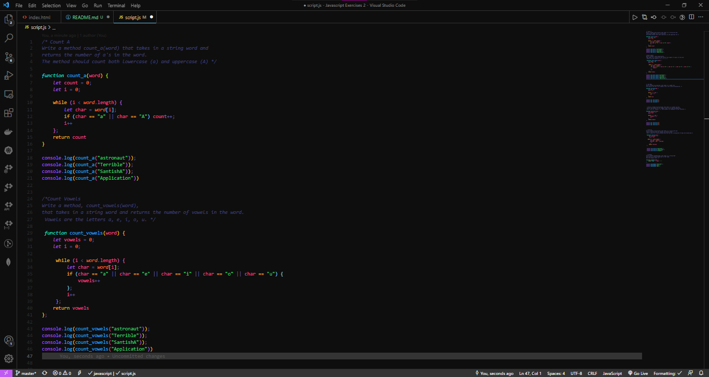
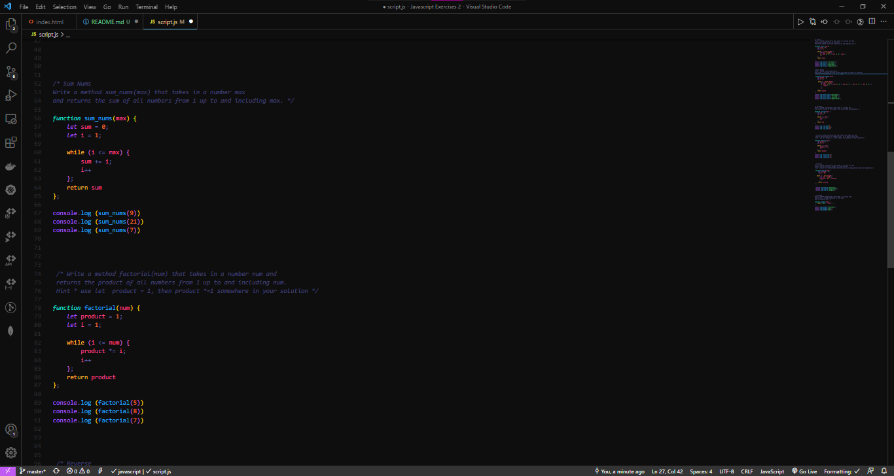
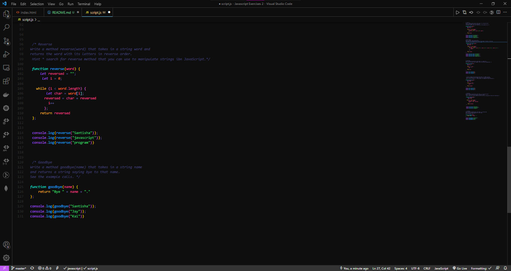
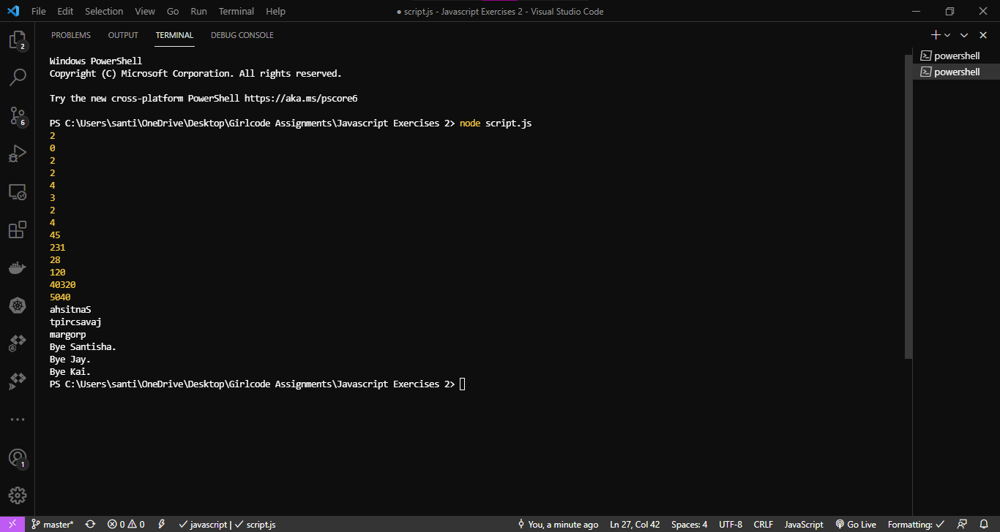

# Javascript-Exercises

This project contains more javascript practice exercises. I made use of functions in order to solve the challenges.

## Project Screenshots

## Languages

- Javascript

## License

[MIT](https://choosealicense.com/licenses/mit/)
